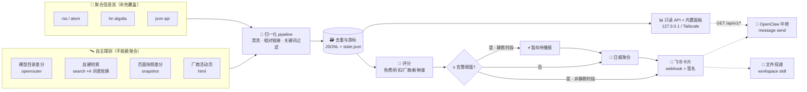
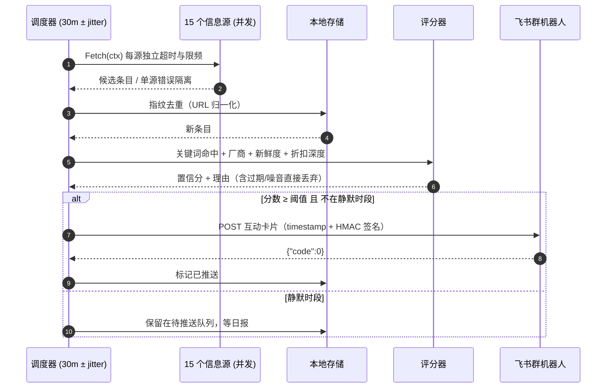
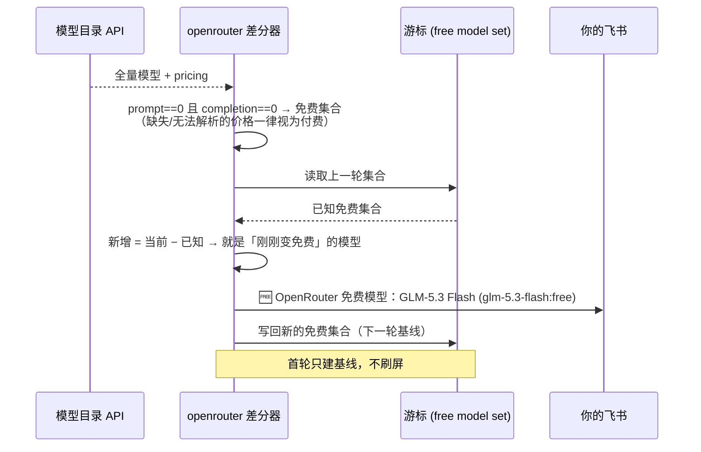
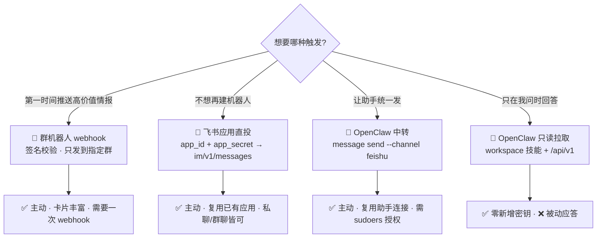

# 🎯 Deal-Hunter · 全网羊毛雷达

> 一个跑在自家服务器上的**折扣 / 免费额度侦察兵**：定期巡检模型目录、厂商活动页、社区信息流，
> 并把真正值得动手的羊毛（如「GLM-5.3-flash 免费」「Qwen3.8-Max 限时 5 折」）推送到飞书。

[](#-快速开始)
[](#-设计取舍)
[](#-部署)
[](#-测试与-ci)
[](#-安全与隐私)
[](LICENSE)

`Deal-Hunter` = 薅羊毛(deal) + 侦察(hunter)。**采集 → 归一 → 去重 → 评分 → 播报**一条链路，
单二进制、零外部依赖、只读面板，默认全部信息源都无需 API Key。

- 🛰 **自主探测优先**：不依赖别人整理好的清单——直接比对模型目录价格、自建关键词检索、对厂商页面做快照差分
- 🧠 **可解释评分**：每条情报带 0–100 置信分与打分理由，低于阈值进日报，不骚扰
- 📲 **两条投递路径**：飞书群机器人卡片（直接调用）**或** OpenClaw 中转（复用助手已有的飞书连接）
- 🔒 **默认不外网暴露**：面板/接口只允许回环或 Tailscale 地址，公网绑定需显式 opt-in
- 🪶 **足够轻**：7.4 MB 静态二进制，无需数据库、无需 Docker、无需前端构建

---

## 📐 架构



**为什么长这样**：羊毛的时效性以小时计，所以采集要宽、投递要狠——只有真正「免费 / 大幅降价 / 指名产品」的条目才值得打断你。

### 🔁 一轮采集的时序



### 🆓 「模型突然免费」是怎么被抓到的



---

## 🗂 内置信息源

评分权重（`trust`）体现了一个原则：**自己查到的 > 别人转述的**。

| 类型 | 名称 | 采集方式 | trust | 说明 |
|---|---|---|---|---|
| 🛰 openrouter | `openrouter-free-models` | 目录价格差分 | 10 | 抓「刚刚转免费」的事件，含价格翻转 |
| 🛰 search | `search-ai-free-cn` | 自建检索·中文词表轮换 | 9 | 大模型免费额度 / 官方公告 |
| 🛰 search | `search-ai-free-en` | 自建检索·英文词表 | 9 | free credits / zero cost inference |
| 🛰 search | `search-cloud-cn` | 自建检索·云产品 | 8 | 首购特惠 / 免费流量包 |
| 🛰 search | `search-devtool-free` | 自建检索·开发工具 | 8 | 学生授权 / 免费版升级码 |
| 🛰 html | `aliyun-benefit` | 活动页文本抽取 | 9 | 官方源，含「新用户免费体验」栅格 |
| 🛰 snapshot | `copilot-plans-snapshot` | 页面快照差分 | 8 | 只在**价格事实发生变化**时播报 |
| 📡 rss | `linux-do-latest` / `aihot-all` / `lowendtalk-latest` / `qbitai-feed` / `v2ex-share` / `sspai-feed` | 订阅 | 4–6 | 社区与资讯补充 |
| 📡 hn | `hn-free-api` / `hn-ai-promo` | Algolia 检索 | 5 | 海外发布与免费层动态 |

> 📌 全部默认源都**不需要任何 API Key**；`kind: search` 走公开的 HTML 检索端点，逐轮轮换查询词以扩大覆盖而不 hammer 上游。

### 可扩展的采集类型

| kind | 用途 | 关键参数 |
|---|---|---|
| `rss` | RSS 2.0 / Atom，容忍畸形实体并自动降级到宽松解析 | `limit` `keywords` `deny` |
| `html` | 服务端渲染页面：按块边界切文本，关键词闸门过滤 | `keywords` `class_contains` `min_text_len` |
| `json` | 任意 JSON API，点号路径映射，无需写代码 | `items_path` `title_path` `url_path` `time_path` `url_prefix` |
| `hn` | Hacker News Algolia 检索 | `query` `tags` `numericFilters` |
| `search` | 自建检索（词表逐轮轮换 + 反查代理链接） | `queries` `site` `kl` `endpoint` |
| `snapshot` | 对同一 URL 的历史快照做差分，只报新增价格事实 | `mode` `focus` |
| `openrouter` | 模型目录免费化事件差分 | `max_new` `first_run_grace_days` |

---

## 🚀 快速开始

```bash
# 1) 构建（无需网络：零第三方依赖）
make build            # 或 go build -o dist/dealhunter ./cmd/dealhunter

# 2) 体检：配置 / 目录 / 密钥 / 外连可达性
./dist/dealhunter doctor

# 3) 单轮试跑，结果打到终端（先别急着推送）
DH_FEISHU_ENABLED=0 ./dist/dealhunter once

# 4) 只盯一个源，看它到底能抓到什么
./dist/dealhunter probe -source search-ai-free-cn

# 5) 配好飞书群机器人后自检推送链路
export DH_FEISHU_WEBHOOK='https://open.feishu.cn/open-apis/bot/v2/hook/...'
export DH_FEISHU_SECRET='...'
./dist/dealhunter notify-test

# 6) 常驻运行（定时采集 + 只读面板）
./dist/dealhunter run
open http://127.0.0.1:8765/          # 内置状态面板
```

<details>
<summary>🖥 内置面板长什么样</summary>

单文件 HTML（`go:embed`，无 CDN、无构建步骤，断网可开）：KPI 卡片、下一轮倒计时、
置信分色阶条、信息源健康度、按分类/关键词筛选的情报流。

```
📊 127.0.0.1:8765
 ├─ KPI   累计发现 17 · 已推送 6 · 待推送 0 · 信息源 15/15 · 本轮 1.7s
 ├─ 🧭 下一轮 28m · 飞书推送 ● 就绪 · 作用域 仅本机/Tailscale
 ├─ 📈 情报流（分数色阶 + 厂商徽章 + 评分理由）
 └─ 🩺 信息源健康度（命中/入库/耗时/错误）
```

</details>

---

## ⚙️ 配置

配置 = **JSON 文件（可提交）** + **DH_\* 环境变量（密钥只走这里）**。文件不存在时用内置默认值，
部分覆盖即可：`config/deal-hunter.example.json` 是完整注释版模板。

```jsonc
{
  "interval": "30m",
  "filter":   { "min_score": 55, "require_offer": true },
  "notify":   { "feishu": { "min_score": 62, "max_per_run": 6, "silent_hours": [0,1,2,3,4,5,6] } },
  "server":   { "bind": "127.0.0.1:8765" }
}
```

| 环境变量 | 作用 |
|---|---|
| `DH_FEISHU_WEBHOOK` / `DH_FEISHU_SECRET` | 群机器人地址与签名密钥（**永不进配置文件**） |
| `DH_OPENCLAW_RELAY` / `DH_OPENCLAW_TARGET` | 启用 OpenClaw 中转与目标会话 |
| `DH_MIN_SCORE` / `DH_INTERVAL` / `DH_LOG_LEVEL` | 运行时调参 |
| `DH_DATA_DIR` / `DH_CONFIG` / `DH_ENV_FILE` | 路径与 env 文件 |
| `DH_SERVER_BIND` / `DH_ALLOW_PUBLIC_BIND` | 面板绑定；公网绑定需显式 opt-in |

### 🎯 评分模型

分数是可解释的加法项（上限 100，命中噪音或已过期直接丢弃）：

| 信号 | 分值 | 例子 |
|---|---|---|
| 免费类 offer | **+45** | `免费` `0元` `free tier` `100% off` |
| 赠送额度 / 代金券 | +30 | `赠送` `credits` `体验金` |
| 折扣 / 试用 / 券 | +24 / +20 / +16 | `5折` `限时体验` `优惠码` |
| 折扣深度 | +4…+12 | ≥50% 才给满 |
| 指名模型或产品 | **+12** | `GLM-5.3-flash` `Qwen3.8-Max` |
| 已知厂商 | +10 | 50+ 家厂商词典 |
| 厂商官方源 | +10 | `sites` 命中域名 |
| 新鲜度 | +12 / +8 / +4，>30 天 −12 | 按发布时间 |
| 信息源可信度 | +0…+10 | 自主探测给满分 |

---

## 📲 投递路径怎么选



四条路径都走 `notify.FanOut`，可同时开启；**任一后端成功即视为已送达**，
所以一个配坏的第二通道不会让告警每轮重发，只有全部失败才回落到日报补投。

> 应用直投的收件人类型由 `DH_FEISHU_RECEIVE_ID_TYPE` 决定（默认 `open_id`）；
> 卡片若被租户策略拒绝会自动降级为纯文本投递，宁可朴素也不丢消息。

---

## 🩺 CLI

```
dealhunter [全局参数] <命令>

  run           常驻：定时采集 + 推送 + 只读面板
  once          跑一轮就退出（-serve 可保持面板）
  serve         只开面板不采集
  probe         单源探测（不写库、不推送，便于排障）
  sources       列出信息源
  deals         查看最近入库
  digest        立刻生成并投递一次日报
  notify-test   全通道链路自检
  doctor        配置/密钥/目录/外连 体检
  secretscan    敏感信息与内网拓扑扫描（发布门禁）
  compact       压缩历史库
```

---

## 🧪 测试与 CI

> ⚠️ **本项目不使用 GitHub Actions**（额度有限）。门禁是本机与办公室构建机上的脚本，退出码即结论。

```bash
bash scripts/ci-local.sh                 # 本机完整门禁：fmt · vet · race 测试 · 敏感信息扫描 · 三平台交叉编译
bash scripts/ci-local.sh --quick         # 快速门禁
DH_CI_HOST=<office-builder> bash scripts/ci-office.sh    # 把同一套门禁搬到办公室机器
git config core.hooksPath .githooks      # 可选：提交前自动跑快门禁
```

`scripts/ci-office.sh` 只打包 `git ls-files` 里的非忽略文件，并在上传前**断言负载里存在 `go.mod`、且不含任何 `.env`**，
避免把本机密钥送到构建机上。

| 关卡 | 内容 |
|---|---|
| 🧩 单元 | 关键词边界、折扣推断、到期解析、评分、去重、游标、压缩、环境变量优先级 |
| 🕸 采集 | 5 类采集器全部离线 fixture 驱动（含畸形 XML 降级、相对链接、代理跳转还原、快照差分） |
| 📮 投递 | httptest 模拟飞书：卡片结构、签名校验、错误码、静默时段、失败留栈、扇出容错 |
| 🔌 接口 | 只读性（非 GET 一律 405）、安全响应头、筛选参数、面板内联、**凭据不外泄** |
| 🔐 安全 | SSRF 阻断（云元数据/内网）、公网绑定拒绝、路径收敛、日志脱敏、仓库敏感信息扫描 |
| 📦 构建 | `CGO_ENABLED=0` 交叉编译 linux/amd64、linux/arm64、windows/amd64 |

---

## 🔐 安全与隐私

- **密钥只来自环境**：`webhook_url`/`secret` 在结构体上是 `json:"-"`，写进配置文件也不会被读取，序列化也不会输出
- **CI 敏感信息门禁**：`internal/secretlint` 扫描仓库中的 24 类凭证特征（飞书/Slack/GitHub/TailSCALE key/AWS/JWT/DSN/私钥块…）、
  高熵字符串，以及 **Tailscale 内网地址与 `.ts.net` 主机名**；命中即 CI 失败（详见 [SECURITY.md](SECURITY.md)）
- **不外网暴露**：面板绑定校验只允许回环、`100.64/10`、`.ts.net`；`0.0.0.0`/公网地址直接拒绝启动
- **SSRF 防护**：出站固定拒绝链路本地与云元数据地址（即使显式放开内网访问也不放行元数据）
- **不越权使用助手凭据**：与 OpenClaw 的联动遵循「只读本地接口 + workspace 脚本 + 固定 argv 的 `message send`」，
  绝不读取 OpenClaw 的 token / 配置
- **抓取礼貌**：按 host 串行限频、响应体上限、失败退避；`secret` 出现在错误信息里会被脱敏后再落日志

---

## 📦 部署

```bash
make build-linux                                    # 产出 dist/dealhunter-linux-amd64
scp dist/dealhunter-linux-amd64 deploy/ user@host:  # 经 Tailscale 拷贝即可，构建机也无需装 Go
sudo ./deploy/install.sh dist/dealhunter-linux-amd64
sudoedit /etc/deal-hunter/deal-hunter.env           # 填入 webhook + 签名密钥
sudo systemctl restart deal-hunter
sudo -u dealhunter /opt/deal-hunter/deal-hunter notify-test
```

systemd 单元带 `ProtectSystem=strict`、`PrivateTmp`、`RestrictAddressFamilies`、`NoNewPrivileges` 等收敛项，
状态目录由 `StateDirectory=` 托管；升级时旧二进制自动时间戳备份，配置文件只增不覆盖。

**OpenClaw 联动（可选）**：

```bash
# A. 只读拉取：以 OpenClaw 的运行用户执行，只放查询脚本 + 技能说明，不碰任何凭据
./deploy/openclaw/install-openclaw-integration.sh

# B. 主动中转：复用助手已连接的飞书会话，不再新建机器人
sudo ./deploy/openclaw/install-openclaw-relay.sh --target <feishu 用户或群 id>
```

中转的权限模型值得说明：网关 token 只落盘在 `root:<gatewayUser> 0640` 的文件里，
服务账户通过一条 sudoers 规则只能调用那个「仅转发 `message send`、并拒绝
`--media/--presentation` 等危险参数」的包装脚本 —— 它拿不到 token 本身，
也无法借道执行别的 OpenClaw 子命令。

> ⚠️ 已知限制：若 OpenClaw 配置里的 `gateway.auth.token` 是**密钥引用**（`{"source":"env",...}`）
> 而不是字面量，该发行版的 `openclaw message send` 本地路径解析不到它，会直接回一句
> `GATEWAY_SECRET_REF_UNAVAILABLE` —— 即使我们已经注入了同名环境变量也不行。
> 此时用路径 A（拉取）或路径 一（群机器人 webhook）即可，脚本会在预检阶段把这条结论打印出来，
> 并在失败时不把通道标记为可用，避免每轮空转刷日志。

---

## 🤝 参与

先看 [CONTRIBUTING.md](CONTRIBUTING.md)：新增采集器请复用 `internal/sources` 的 `base`，
并补一个离线 fixture 测试；**不要**往仓库里放任何真实 webhook、token 或内网主机名（CI 会拦你）。

## 🗺 Roadmap

- [ ] 更多官方目录差分（推理云平台 / 向量库 / GPU 云）
- [ ] 羊毛到期提醒（结合已解析的 `expires_at`）
- [ ] 指纹级相似度去重（同一活动多站点转发）
- [ ] 可选 SQLite 后端（当前 JSONL 对个人规模足够）
- [ ] Webhook 多群路由与分类订阅

## 📄 License

[MIT](LICENSE)
