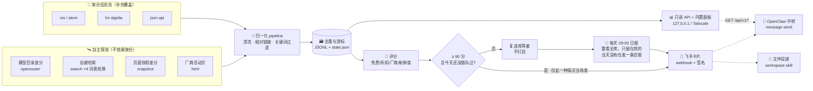
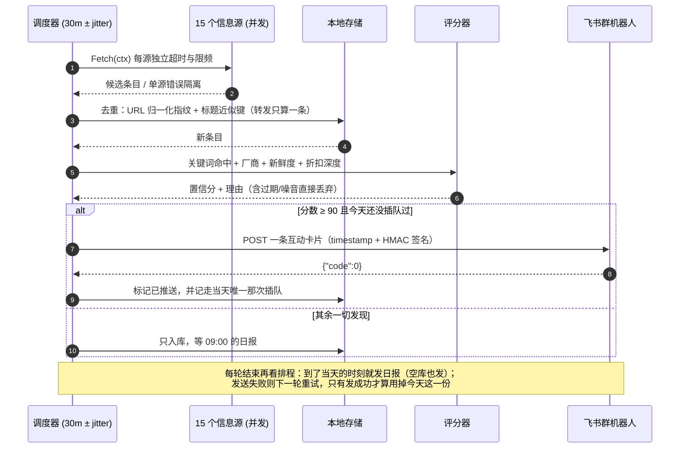
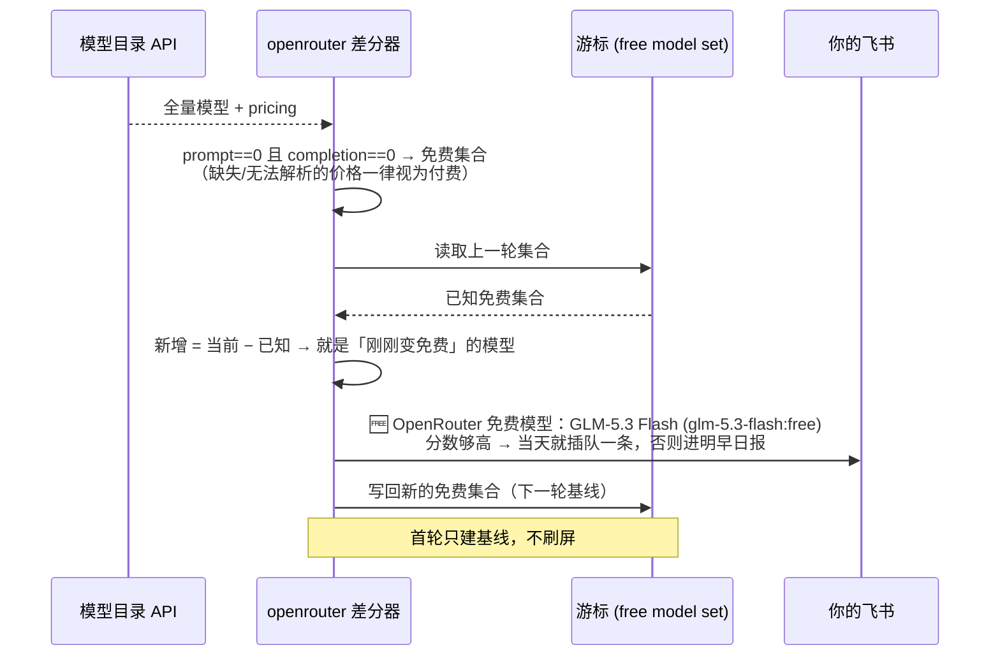
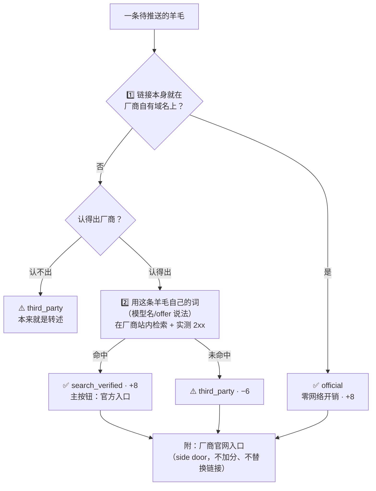
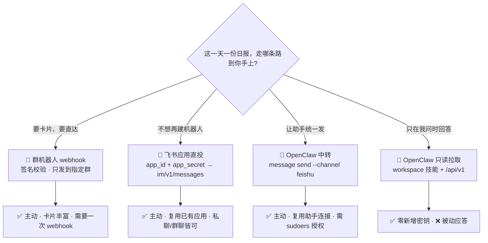

# 🎯 Deal-Hunter · 全网羊毛雷达

> 一个跑在自家服务器上的**折扣 / 免费额度侦察兵**：定期巡检模型目录、厂商活动页、社区信息流，
> 每天 09:00 把真正值得动手的羊毛（如「GLM-5.3-flash 免费」「Qwen3.8-Max 限时 5 折」）
> 合成**一份日报**推到飞书。

[](#-快速开始)
[](#-设计取舍)
[](#-部署)
[](#-测试与-ci)
[](#-安全与隐私)
[](LICENSE)

`Deal-Hunter` = 薅羊毛(deal) + 侦察(hunter)。**采集 → 归一 → 去重 → 评分 → 日报**一条链路，
单二进制、零外部依赖、只读面板，默认全部信息源都无需 API Key。

- 🛰 **自主探测优先**：不依赖别人整理好的清单——直接比对模型目录价格、自建关键词检索、对厂商页面做快照差分
- 🌅 **一天就一份日报**：09:00 把当前仍在效的免费/优惠重列一遍，带收录时长与截止时间；**当天没有在效的也发一条空报**，好让你知道雷达还在转
- ⚡ **最多插队一次**：分数 ≥ 90 的发现（例如刚转免费的模型）当天可以不等日报，其余一律等
- ⏰ **限时事件提醒**：消费券这类「有时刻的事件」不等第二天日报——开抢前 45 分钟提醒一次，
  迟到 15 分钟内仍算数；**同一张卡也管到期**，快作废前 3 小时再说一次。每个事件只提醒一次，一天最多两条
- 🧠 **可解释评分**：每条情报带 0–100 置信分与打分理由，命中噪音或已过期直接不入库
- 📲 **两条投递路径**：飞书群机器人卡片（直接调用）**或** OpenClaw 中转（复用助手已有的飞书连接）
- 🔒 **默认不外网暴露**：面板/接口只允许回环或 Tailscale 地址，公网绑定需显式 opt-in
- 🪶 **足够轻**：7.4 MB 静态二进制，无需数据库、无需 Docker、无需前端构建

---

## 📐 架构



**为什么长这样**：羊毛确实有时效，但**值得打断你的时刻极少**——采集要宽，投递要收。
一天一份日报负责「今天有什么能领」，一条高分插队负责「刚刚有个不该错过的」，其余全部等着。

### 🔁 一轮采集的时序



### 🆓 「模型突然免费」是怎么被抓到的



---

## 🗂 内置信息源

评分权重（`trust`）体现了一个原则：**自己查到的 > 别人转述的**。

| 类型 | 名称 | 采集方式 | trust | 说明 |
|---|---|---|---|---|
| 🛰 openrouter | `openrouter-free-models` | 目录价格差分 | 10 | 抓「刚刚转免费」的事件，含价格翻转 |
| 🛰 search | `search-ai-free-cn` | 自建检索·中文词表轮换 | 9 | 大模型免费额度 / 官方公告 |
| 🛰 search | `search-ai-free-en` | 自建检索·英文词表 | 9 | free credits / zero cost inference |
| 🛰 search | `search-cloud-cn` | 自建检索·云产品 | 8 | 首购特惠 / 免费流量包 |
| 🛰 search | `search-devtool-free` | 自建检索·开发工具 | 8 | 学生授权 / 免费版升级码 |
| 🛰 html | `aliyun-benefit` | 活动页文本抽取 | 9 | 官方源，含「新用户免费体验」栅格 |
| 🛰 snapshot | `copilot-plans-snapshot` | 页面快照差分 | 8 | 只在**价格事实发生变化**时播报 |
| 📡 rss | `linux-do-latest` / `aihot-all` / `lowendtalk-latest` / `qbitai-feed` / `v2ex-share` / `sspai-feed` | 订阅 | 4–6 | 社区与资讯补充 |
| 📡 hn | `hn-free-api` / `hn-ai-promo` | Algolia 检索 | 5 | 海外发布与免费层动态 |

> 📌 全部默认源都**不需要任何 API Key**；`kind: search` 走公开的 HTML 检索端点，逐轮轮换查询词以扩大覆盖而不 hammer 上游。

### 可扩展的采集类型

| kind | 用途 | 关键参数 |
|---|---|---|
| `rss` | RSS 2.0 / Atom，容忍畸形实体并自动降级到宽松解析 | `limit` `keywords` `deny` |
| `html` | 服务端渲染页面：按块边界切文本，关键词闸门过滤 | `keywords` `class_contains` `min_text_len` |
| `json` | 任意 JSON API，点号路径映射，无需写代码 | `items_path` `title_path` `url_path` `time_path` `url_prefix` |
| `hn` | Hacker News Algolia 检索 | `query` `tags` `numericFilters` |
| `search` | 自建检索（词表逐轮轮换 + 反查代理链接） | `queries` `site` `kl` `endpoint` |
| `snapshot` | 对同一 URL 的历史快照做差分，只报新增价格事实 | `mode` `focus` |
| `openrouter` | 模型目录免费化事件差分 | `max_new` `first_run_grace_days` |

---

## 🚀 快速开始

```bash
# 1) 构建（无需网络：零第三方依赖）
make build            # 或 go build -o dist/dealhunter ./cmd/dealhunter

# 2) 体检：配置 / 目录 / 密钥 / 外连可达性
./dist/dealhunter doctor

# 3) 单轮试跑，结果打到终端（先别急着推送）
DH_FEISHU_ENABLED=0 ./dist/dealhunter once

# 4) 只盯一个源，看它到底能抓到什么
./dist/dealhunter probe -source search-ai-free-cn

# 5) 配好飞书群机器人后自检推送链路
export DH_FEISHU_WEBHOOK='https://open.feishu.cn/open-apis/bot/v2/hook/...'
export DH_FEISHU_SECRET='...'
./dist/dealhunter notify-test

# 6) 常驻运行（定时采集 + 只读面板）
./dist/dealhunter run
open http://127.0.0.1:8765/          # 内置状态面板
```

<details>
<summary>🖥 内置面板长什么样</summary>

单文件 HTML（`go:embed`，无 CDN、无构建步骤，断网可开）。设计原则和飞书卡片一致：
**先看结论，细节点开再看**。

```
📊 127.0.0.1:8765
 ├─ KPI   累计发现 · 突破推送 · 今日日报（已发/未发）· 信息源 15/15 · 本轮用时 · 链接成色 25%
 ├─ 🧭 飞书 ● app · 下一轮 29m · 🌅 日报 09:00 · 最后同步 17:35:16
 ├─ 📈 情报流  一行一条：分数 · 标题(官方页优先) · ✅/⚠️ · 相对时间 · 「详情」
 │             展开后才是摘要、徽章、评分理由、原始出处与厂商官网入口
 ├─ 🕒 采集记录  最近 8 轮的新增/插队/转日报/官方定位/错误与耗时（读 /api/v1/runs）
 └─ 🩺 信息源健康度  命中/入库/耗时/错误 + 官方源标记
```

「今日日报」那一格直接回答今天还会不会收到消息：值是可点名的**已发 / 未发**，
下面写着「在效 N 条 · 突破 ≥90，今日 0/1」——前者是明早日报会带多少条，后者是今天还剩几次插队。

同一活动被多个源转发时只算一条：先见到的那条拥有这个标题（`meta.dup_of` 记录它重复于谁），
**不重复推送、不进日报**，面板默认折叠并在计数处写明「已折叠 N 条重复」，点「↻ 含重复」可展开看全。

列表默认只渲染 24 条（其余「显示更多」），展开状态按指纹记忆，翻页与筛选不会把
正在看的那条合上；键盘可达（chips 与详情都是 `button`）、`prefers-reduced-motion`
下不播放动效，次要文字对比度 ≥ 4.5:1；手机宽度下 KPI 改三列紧凑排布，让列表进首屏。

</details>

---

## ⚙️ 配置

配置 = **JSON 文件（可提交）** + **DH_\* 环境变量（密钥只走这里）**。文件不存在时用内置默认值，
部分覆盖即可：`config/deal-hunter.example.json` 是完整注释版模板。

要加自己城市的源，用 `extra_sources`——它**追加**在生效的源集合后面（内置 15 源照常随版本升级），
而不是像 `sources` 那样整盘替换：

```jsonc
{ "extra_sources": [
  { "name": "nc-vouchers", "kind": "html", "category": "voucher", "trust": 10,
    "url": "https://swj.nc.gov.cn/ncsswj/tzgg/index.shtml",
    "keywords": ["消费券", "惠民券", "抢券", "核销", "领取"],
    "deny": ["以旧换新", "招标", "中标", "遴选", "服务机构"],
    "params": { "follow_detail": "1" } }
] }
```

`follow_detail` 只对**过了关键词门**的那几条再抓一次正文（开抢时刻写在正文里，不在列表行上），
所以一页 20 条通常只多 0–2 次外连。正文短于 200 字（政务站的"频繁访问"页就是这样）会被当作
没抓到，保留列表行文本；入库存取时正文截到 2000 字。

```jsonc
{
  "interval": "30m",
  "timezone": "Asia/Shanghai",
  "filter":   { "require_offer": true, "max_age_hours": 336 },
  "notify": {
    "feishu": { "enabled": true },
    "daily":  { "enabled": true, "at": "09:00", "min_score": 45, "max_items": 15 },
    "urgent": { "enabled": true, "min_score": 90, "max_per_day": 1, "max_items": 5 },
    "event":  { "enabled": true, "lead_time": "45m", "late_grace": "15m", "expiry_lead": "3h",
                "min_score": 60, "max_per_day": 2, "max_items": 3 }
  },
  "server":   { "bind": "127.0.0.1:8765" }
}
```

`timezone` 是**唯一**的读者时钟：日报的 09:00、开抢前 45 分钟、到期前 3 小时和卡片页脚都按它
解释，写错（不存在的区划名）会在启动时直接拒绝，而不是悄悄退回主机时区 —— 服务常年跑 UTC，
退回等于 everything 差 8 小时。

两道分数线各管一件事，别再混用：

| 键 | 管什么 | 默认 |
|---|---|---|
| `filter.require_offer` | 没有任何优惠信号的条目**根本不入库** | `true` |
| `notify.daily.min_score` | 日报收录的地板（在效 + 可领才会列出来） | 45 |
| `notify.urgent.min_score` | 高过此分才允许当天不等日报 | 90 |
| `notify.event.lead_time` | 开抢前多久可以提醒（精度等于采集间隔） | 45m |
| `notify.event.late_grace` | 开抢后多久之内提醒仍有意义 | 15m |
| `notify.event.expiry_lead` | 到期前多久再提醒一次；`0s` 关掉到期侧 | 3h |
| `notify.event.max_per_day` | 一天最多几条提醒（每个事件至多 1 次）；**写 `0` 就是不发** | 2 |

> 曾经还有个 `filter.min_score` / `DH_MIN_SCORE`，看着像入库门槛，实际上从没有任何代码
> 读它做过过滤——已删除。要按分数筛着看，用 `dealhunter deals -min` 或面板的 `?min=`。

| 环境变量 | 作用 |
|---|---|
| `DH_FEISHU_WEBHOOK` / `DH_FEISHU_SECRET` | 群机器人地址与签名密钥（**永不进配置文件**） |
| `DH_OPENCLAW_RELAY` / `DH_OPENCLAW_TARGET` | 启用 OpenClaw 中转与目标会话 |
| `DH_MIN_SCORE` / `DH_INTERVAL` / `DH_LOG_LEVEL` | 入库地板与节奏（`DH_MIN_SCORE` 只管入库，不再兼任告警阈值） |
| `DH_DAILY_ENABLED` / `DH_DAILY_AT` | 日报开关与时刻（按 `timezone` 解释，格式必须是 `HH:MM`） |
| `DH_URGENT_ENABLED` / `DH_URGENT_MIN_SCORE` | 插队开关与门槛；关掉就真的只发一份 |
| `DH_DATA_DIR` / `DH_CONFIG` / `DH_ENV_FILE` | 路径与 env 文件 |
| `DH_SERVER_BIND` / `DH_ALLOW_PUBLIC_BIND` | 面板绑定；公网绑定需显式 opt-in |

### 🎯 评分模型

分数是可解释的加法项（上限 100，命中噪音或已过期直接丢弃）：

| 信号 | 分值 | 例子 |
|---|---|---|
| 免费类 offer | **+45** | `免费` `0元` `free tier` `100% off` |
| 赠送额度 / 代金券 | +30 | `赠送` `credits` `体验金` |
| 折扣 / 试用 / 券 | +24 / +20 / +16 | `5折` `限时体验` `优惠码` |
| 折扣深度 | +4…+12 | ≥50% 才给满 |
| 指名模型或产品 | **+12** | `GLM-5.3-flash` `Qwen3.8-Max` |
| 已知厂商 | +10 | 50+ 家厂商词典 |
| 厂商官方源 | +10 | `sites` 命中域名 |
| 新鲜度 | +12 / +8 / +4，>30 天 −12 | 按发布时间 |
| 信息源可信度 | +0…+10 | 自主探测给满分 |
| 链接指向厂商自有域名 | **+8** | 见下一节，改写前必须实测可访问 |
| 只有第三方转述 | −6 | 站内检索跑通了但找不到厂商页（检索不可用时不扣分） |

---

### 🔗 链接校准：优先给官方入口

社区帖说「XX 免费」不等于你能在 XX 官网上点到。但**把厂商首页价格页当成活动入口**同样是不准的：
一条讲 JetBrains 学生认证的知乎帖，链到 `github.com/features/copilot/plans` 只会误导。
所以这里的判定分两种角色，绝不含混：



| 约束 | 做法 |
|---|---|
| 不认错厂商 | 域名表是**人工精选**（30+ 家），子域必须落在白名单域内；`moonshot.cn.evil.test` 这类仿冒直接拒绝 |
| 不链到死页 | 改写前必须真的探测到 2xx/3xx，并记录重定向后的最终地址 |
| **不被跳转带偏** | 跳转后的域名必须**仍然属于该厂商**；`anthropic.com/pricing → claude.com` 之外的促销页一律拒绝 |
| 入口页不冒充证据 | 精选入口页只作为「去官网核实」的侧链，永远不会成为主链接，也不加分 |
| 检索用这条羊毛的词 | 只有拿模型名/offer 说法在厂商站内搜到的页面，才算「定位到了这个活动」 |
| 不无限外连 | 每轮预算 `filter.max_official_lookups`（默认 16 次），用完如实标注且不扣分 |
| 不反复打扰上游 | 判定与探测结果各缓存 7 天；厂商自有域名的记录一条都不查 |
| 不掩盖出处 | `d.URL` 永不被覆盖，官方链接写在 `meta.official_url`，原始帖在 `meta.original_url`，入口页在 `meta.vendor_url` |

面板新增 **✅ 已定位官方页** 过滤器与「厂商官网」侧链，`/api/v1/deals`、日报、OpenClaw 拉取和
`dealhunter deals` 都读同一份判定；`/api/v1/status` 的 `last_run.verified_official / third_party_links`
说明本轮的成色。

零成本的判定（厂商自有域名 / 根本认不出厂商）对**每一条入库记录**生效；联网的两级只对
**当天插队的条目**和**日报真正要列出的条目**做——所以一份日报发出前会先把它要报的那十几条
回查一遍（判定结果缓存 7 天，每份最多 16 次外连）。所以「没有徽章」= 知道厂商但还没去核实，
而不是「已核实为第三方」。

---

## 📬 消息长什么样

一天就一份日报，只给结论，细节留在面板；高分插队那条也是同样的一行一条。

### 🌅 09:00 的日报（主角）

它不等队列、不看谁"新"，而是重看**整个库**，只留下还没过期且确实能领的条目——
所以一条三天前发布的免费额度今天仍然在列：

```text
🌅 羊毛日报 · 12 条仍在效                       ← 抬头：条数即结论
09月19日 · 新增 2 · 持续 10                     ← 一句话交代今天有多少是新货
🆕 今日新收录
🆓 [智谱 GLM-5.3-flash 限时免费](…) · 92 ✅ · 已收录 3 小时 · 截止 10-01
🏷️ [阿里云 Qwen3.8-Max 5 折](…) · 71 ⚠️ · 已收录 1 小时
⏳ 持续在效
🆓 [OpenRouter 免费模型：Nex-N2.5-Mini](…) · 87 ✅ · 已收录 3 天
🆓 [某厂商对象存储 20GB 免费额度](…) · 68 ✅ · 已收录 5 天
Deal-Hunter · 09-19 09:00
```

当天什么都没有，也照样发——空报回答的是"雷达还在转吗"：

```text
🌅 羊毛日报 · 今天没有在效的
09月20日 · 新增 0 · 持续 0
Deal-Hunter · 09-20 09:00
```

| 字段 | 来源 |
|---|---|
| 🆕 / ⏳ 分段 | `notify.SplitByAge`：首次发现不满 24 小时算新收录，其余是持续在效；空段不显示 |
| 是否仍在效 | 评分时解析到的截止日期（`meta.expires_at`）没过期，或压根没有期限 |
| 是不是能领 | `Deal.Claimable()`：带免费/折扣/试用/额度/券信号，且不是提问或吐槽 |
| 已收录 N 小时 / N 天 | 首次发现时间 → 现在，回答"我睡过了多久" |
| 截止 MM-DD | 活动自己声明的期限，没有就不显示 |
| 重复的旧条目 | 日报是快照，**不会**把条目重新标成已推送（否则下次插队会漏掉它） |
| 空库 | 仍发一条，并且仍算用掉今天这一份（不会白天每轮再刷一次） |

「限时免费？」、「是不是也有额度限制」、「也要吐槽一下」这类帖子会被 `Claimable()`
挡在日报之外——日报回答的是"今天还能领什么"，不是"大家在讨论什么"。

### ⚡ 高分插队（每天最多一条）

只有分数 ≥ 90 的发现可以不等明早，且一天一次；卡片与单条告警同构：

```text
🆓 免费 · 智谱 GLM-5.3-flash 限时免费开放        ← 一条时：标题进抬头
置信分 92 · 智谱AI · ✅ 官方页已校验
> 官方公告：API 调用 0 元。
[ 官方入口 ] [ 原始出处 ]
Deal-Hunter · 09-19 15:41

⚡ 值得立刻看 3 条                               ← 同一轮多条：一行一条
🆓 [智谱 GLM-5.3-flash 限时免费](…) · 92 ✅
🏷️ [阿里云 Qwen3.8-Max 5 折](…) · 91 ✅
⚠️ [某社区帖说的免费活动](…) · 90 ⚠️
Deal-Hunter · 09-19 15:41
```

`✅` = 链接已在厂商自己的域名上核实过；`⚠️` = 只有第三方转述，点进去自己判断。
评分理由、标签、命中词、原始出处都在面板与 `/api/v1/deals` 里，卡片不再重复。

插队失败（飞书挂了、中转没配好）**不算用掉今天那一次**，下一轮还会重试；
而条目本身早就入库，实在没插成也会出现在明早的日报里——所以"等日报"从来不会丢东西。

### ⏰ 限时事件提醒（每个事件一次，一天最多两条）

消费券、限量秒杀这类东西的关键不是"值不值"，而是**几点开始、几点作废**。公告通常提前几天发布，
所以提醒不能等第二天的日报，也不能在开抢后才说：

```text
⏰ 09月21日 10:00 开抢 · 关于开展2026年洪城消费券发放的公告
置信分 78 · 南昌市商务局 · 满100元减30元
[ 官方公告 ]
Deal-Hunter · 09-21 09:35

⏰ 2 项临近截止                           ← 同一轮多条：抬头只放一个时刻，
· 09月26日 23:59 截止 · 洪城消费券第三批       所以每一条在正文里带上自己的时刻
· 09月27日 10:00 开抢 · 洪城消费券第四轮
Deal-Hunter · 09-26 21:00
```

以下几条规则值得单独说，因为它们决定了"提醒"到底可不可信：

- **只认写得清楚的时刻**：解析不出「明确日期 + 明确时刻」就不提醒。`9时`、`暂定近期`、
  `每日上午9:00`（没有日期）一律不算 —— 猜错日子会推一条假提醒，那比不提醒糟得多。
- **窗口 = 开抢前 45 分钟 至 开抢后 15 分钟**，且每个事件至多一次（跨重启也算，靠
  `event:reminded:` 记录）。因此提醒时刻的精度等于采集间隔：默认 30m 下，可能是提前
  25 分钟告诉你，也可能迟到 5 分钟 —— 想要分钟级 precision，把 `DH_INTERVAL` 调小。
- **到期侧只看还没过去的截止时刻**：`notify.event.expiry_lead`（默认 3h）之内提醒一次，
  已经过期的绝不提醒 —— 那是一条无法执行的提醒。日报是早上发的，"今晚作废"这句话等到
  读者想起来时往往已经过了十几个小时，所以到期要单独开口。
  边界写得比"不过期"更严一点：**截止时刻正好等于本轮的"现在"也不发**，因为那一刻已经没有
  任何动作可做了；开抢侧相反，晚了 15 分钟仍然值得说一句（那是还能领的券）。
- **`max_per_day: 0` 是真的 0**：想安静就把对应通道写 0 或 `enabled: false`。以前 0 会被
  偷偷抬成 1，等于"静音"变成"每天一条惊喜"。（`max_items` 不同：写 0 用默认值。）
- **一行只提醒一次，两个钟共用同一个标记**：一张券先命中"要开抢"就不会再命中"要作废"，
  同一件事不会说两遍。混排时按"还有多久发生"排序，最紧的排最前。
- **两种写法都能读出结束**：带前置词的「核销期限至2026年10月15日」，以及**起止区间**
  「2026年9月18日10:00至2026年9月30日23:59」——后者没有任何"截止"字样，只被前半个日期
  认成开抢时刻时，这条会被当成"没说何时结束的限时事件"整条掉出日报（生产真实发生过）。
  前置词那一条认这些说法：`截止 / 截至 / 有效期至 / 核销期限 / 使用期限 / 结束时间 / 活动至 /
  到期 / 开放至 / 持续至 / 顺延至 / 延期至 / 延长至 / 免费至 / 限免至`，中间允许夹几个字
  （`免费使用期限直接顺延至2026年8月31日` 读得出）；反过来，`2026 年 12 月 31 日前注册`
  这种"年写全 + 前"的说法也认。**不写年份的日期（`截止至8月28日`）仍然不认**，那是猜。
- **公告永不下架也不标结束**，所以券类必须有明确有效期才进日报；没写的只提醒一次，
  绝不第二天还来告诉你"这张券仍在效"。

> 端内平台（云闪付 / 美团 / 支付宝）的额度与剩余拿不到，也不该拿：Deal-Hunter 只读公开
> 页面。所以提醒说的是"几点开抢、哪份公告"，具体剩多少请进平台确认。

时刻按 `timezone`（默认 `Asia/Shanghai`）解释，服务跑在 UTC 也不受影响；
`DH_DAILY_ENABLED=0` 或 `notify.daily.enabled=false` 可关闭，`dealhunter daily -dry`
随时预览，`dealhunter daily` 立刻发一次。

---

## 📲 投递路径怎么选



四条路径都走 `notify.FanOut`，可同时开启；**任一后端成功即视为已送达**。
这个取舍在一天只有一份消息的时代变得更尖锐：重复投递比朴素更烦人，所以配坏的第二通道
不会让今天这份重发一遍——它的失败只进日志，当天那一份仍算发过了。只有**全部**失败
才算没发出去，日报会在下一轮重试。

> 应用直投的收件人类型由 `DH_FEISHU_RECEIVE_ID_TYPE` 决定（默认 `open_id`）；
> 卡片若被租户策略拒绝会自动降级为纯文本投递，宁可朴素也不丢消息。

---

## 🩺 CLI

```
dealhunter [全局参数] <命令>

  run           常驻：定时采集 + 每天一份日报 + 只读面板
  once          跑一轮就退出（-serve 可保持面板）
  serve         只开面板不采集
  probe         单源探测（不写库、不推送，便于排障）
  sources       列出信息源
  deals         查看最近入库（-min 按分数筛着看）
  daily         立刻发送今天的日报（占用当天那一份）；-dry 只列出
  notify-test   全通道链路自检
  doctor        配置/密钥/目录/外连 体检
  secretscan    敏感信息与内网拓扑扫描（发布门禁）
  compact       压缩历史库
```

> **看到搜索型信源连着报 `demanded a human check`**：那是 DuckDuckGo 认定出口 IP 像机器人，
> 回了 HTTP 200 的人机验证页（不是没羊毛，也不是网络故障）。等一会儿通常自己就好；换出口
> （另一台机器/另一条线路）也会立刻恢复。这一段结论在 2026-09-21 实测过：同一时刻生产机被验证、
> 另一台机器照样搜得到。`html` / `rss` 这类直连官方页的信源不受影响。

---

## 🧪 测试与 CI

> ⚠️ **本项目不使用 GitHub Actions**（额度有限）。门禁是本机与办公室构建机上的脚本，退出码即结论。

```bash
bash scripts/ci-local.sh                 # 本机完整门禁：fmt · vet · race 测试 · 敏感信息扫描 · 三平台交叉编译
bash scripts/ci-local.sh --quick         # 快速门禁
DH_CI_HOST=<office-builder> bash scripts/ci-office.sh    # 把同一套门禁搬到办公室机器
git config core.hooksPath .githooks      # 可选：提交前自动跑快门禁
```

`scripts/ci-office.sh` 只打包 `git ls-files` 里的非忽略文件，并在上传前**断言负载里存在 `go.mod`、且不含任何 `.env`**，
避免把本机密钥送到构建机上。

| 关卡 | 内容 |
|---|---|
| 🧩 单元 | 关键词边界、折扣推断、到期解析、评分、去重、游标、压缩、环境变量优先级 |
| 🕸 采集 | 5 类采集器全部离线 fixture 驱动（含畸形 XML 降级、相对链接、代理跳转还原、快照差分） |
| 📮 投递 | httptest 模拟飞书：卡片结构、签名校验、错误码、扇出容错；一天一份的排程与插队预算（含新装首次触发、空报、失败不占预算） |
| 🔌 接口 | 只读性（非 GET 一律 405）、安全响应头、筛选参数、面板内联、**凭据不外泄** |
| 🔐 安全 | SSRF 阻断（云元数据/内网）、公网绑定拒绝、路径收敛、日志脱敏、仓库敏感信息扫描 |
| 📦 构建 | `CGO_ENABLED=0` 交叉编译 linux/amd64、linux/arm64、windows/amd64 |

---

## 🔐 安全与隐私

- **密钥只来自环境**：`webhook_url`/`secret` 在结构体上是 `json:"-"`，写进配置文件也不会被读取，序列化也不会输出
- **CI 敏感信息门禁**：`internal/secretlint` 扫描仓库中的 24 类凭证特征（飞书/Slack/GitHub/Tailscale `tskey-`/AWS/JWT/DSN/私钥块…）、
  高熵字符串，以及 **Tailscale 内网地址与 `.ts.net` 主机名**；命中即 CI 失败（详见 [SECURITY.md](SECURITY.md)）
- **提交身份也在门禁内**：`scripts/check-identity.sh` 拒绝把个人邮箱（消费者域名或纯数字账号）写进提交，
  项目身份用 `@users.noreply.github.com`，pre-commit 与 CI 双重执行
- **不外网暴露**：面板绑定校验只允许回环、`100.64/10`、`.ts.net`；`0.0.0.0`/公网地址直接拒绝启动
- **SSRF 防护**：出站固定拒绝链路本地与云元数据地址（即使显式放开内网访问也不放行元数据）
- **不越权使用助手凭据**：与 OpenClaw 的联动遵循「只读本地接口 + workspace 脚本 + 固定 argv 的 `message send`」，
  绝不读取 OpenClaw 的 token / 配置
- **抓取礼貌**：按 host 串行限频、响应体上限、失败退避；`secret` 出现在错误信息里会被脱敏后再落日志

---

## 📦 部署

```bash
make build-linux                                    # 产出 dist/dealhunter-linux-amd64
scp dist/dealhunter-linux-amd64 deploy/ user@host:  # 经 Tailscale 拷贝即可，构建机也无需装 Go
sudo ./deploy/install.sh dist/dealhunter-linux-amd64
sudoedit /etc/deal-hunter/deal-hunter.env           # 填入 webhook + 签名密钥
sudo systemctl restart deal-hunter
sudo -u dealhunter /opt/deal-hunter/deal-hunter notify-test
```

systemd 单元带 `ProtectSystem=strict`、`PrivateTmp`、`RestrictAddressFamilies`、`NoNewPrivileges` 等收敛项，
状态目录由 `StateDirectory=` 托管；升级时旧二进制自动时间戳备份，配置文件只增不覆盖。

**OpenClaw 联动（可选）**：

```bash
# A. 只读拉取：以 OpenClaw 的运行用户执行，只放查询脚本 + 技能说明，不碰任何凭据
./deploy/openclaw/install-openclaw-integration.sh

# B. 主动中转：复用助手已连接的飞书会话，不再新建机器人
sudo ./deploy/openclaw/install-openclaw-relay.sh --target <feishu 用户或群 id>
```

中转的权限模型值得说明：网关 token 只落盘在 `root:<gatewayUser> 0640` 的文件里，
服务账户通过一条 sudoers 规则只能调用那个「仅转发 `message send`、并拒绝
`--media/--presentation` 等危险参数」的包装脚本 —— 它拿不到 token 本身，
也无法借道执行别的 OpenClaw 子命令。

> ⚠️ 已知限制：若 OpenClaw 配置里的 `gateway.auth.token` 是**密钥引用**（`{"source":"env",...}`）
> 而不是字面量，该发行版的 `openclaw message send` 本地路径解析不到它，会直接回一句
> `GATEWAY_SECRET_REF_UNAVAILABLE` —— 即使我们已经注入了同名环境变量也不行。
> 此时用路径 A（拉取）或路径 一（群机器人 webhook）即可，脚本会在预检阶段把这条结论打印出来，
> 并在失败时不把通道标记为可用，避免每轮空转刷日志。

### 备份与恢复

状态目录 `0750 dealhunter` 且只有本机一份，所以它需要自己的备份：

```bash
sudo ./deploy/backup.sh                          # 写到 /var/backups/deal-hunter，默认留 14 份
DH_BACKUP_PUSH=other-host:/backups/dh sudo ./deploy/backup.sh   # 顺手另存一份到别的磁盘
sudo systemctl enable --now deal-hunter-backup.timer            # 每晚 04:30，错过开机就补跑
```

脚本不只会打包，还会**把刚写出来的归档解到临时目录再对比一遍**：`deals.jsonl` 行数、
`config.json` 是否在位、校验和是否对得上，任一不过就不报成功——没被打开过的备份只是个愿望。
归档里含 `deal-hunter.env`（webhook 与签名密钥），所以整个脚本以 `umask 077` 运行，
落盘 0600、目录 0750。

恢复不需要任何工具，也不需要装回原机器：

```bash
sudo systemctl stop deal-hunter
sudo tar xzf deal-hunter-<stamp>.tar.gz -C /
sudo chown -R dealhunter:dealhunter /var/lib/deal-hunter
sudo systemctl start deal-hunter && sudo -u dealhunter /opt/deal-hunter/deal-hunter doctor -net=false
```

`doctor` 那一行的「已见 / 已推送 / 游标 / KB」四个数与备份前一致，才算恢复成功。

---

## 🤝 参与

先看 [CONTRIBUTING.md](CONTRIBUTING.md)：新增采集器请复用 `internal/sources` 的 `base`，
并补一个离线 fixture 测试；**不要**往仓库里放任何真实 webhook、token 或内网主机名（CI 会拦你）。

## 🗺 Roadmap

完整版在 **[docs/ROADMAP.md](docs/ROADMAP.md)**（当前 Milestone、下一步候选、技术债、非目标），
项目当前状态见 **[docs/STATUS.md](docs/STATUS.md)**。这里只留最关心的几条：

- [~] **本地消费券**：抓官方发布页、解析开抢与核销期限、开抢前与到期前提醒 —— 代码与测试已完成，
  已部署，剩"按下一条真实公告复核"（设计见 [docs/superpowers/specs/](docs/superpowers/specs/)）
- [x] 交付形态收敛为**一天一份日报**，高分发现当天最多插队一条
- [x] 每天 09:00 日报：重列当前仍在效的免费/优惠，带收录时长与 `expires_at` 截止日
- [ ] 更多官方目录差分（推理云平台 / 向量库 / GPU 云）
- [x] 近似标题去重：同一活动被多个源转发时只播一次（`meta.dup_of`，面板默认折叠）
- [x] 到期前提醒：同一张 ⏰ 卡也管截止，到期前 3 小时再说一次（`notify.event.expiry_lead`）
- [ ] 可选 SQLite 后端（当前 JSONL 对个人规模足够）

## 📄 License

[MIT](LICENSE)
